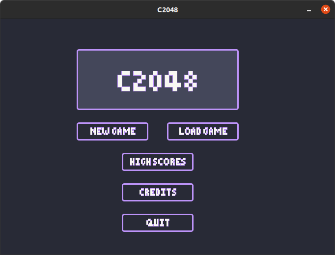
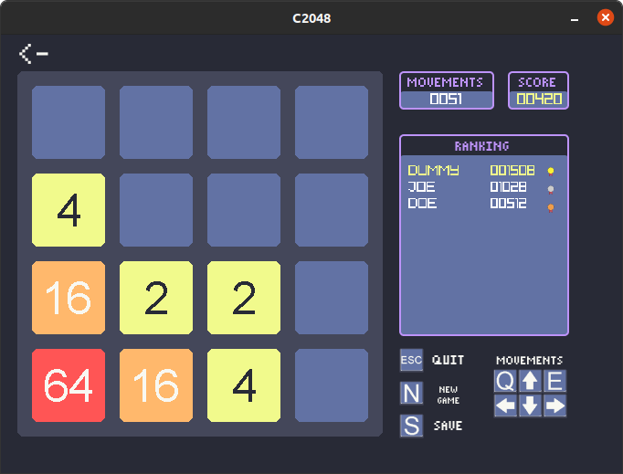
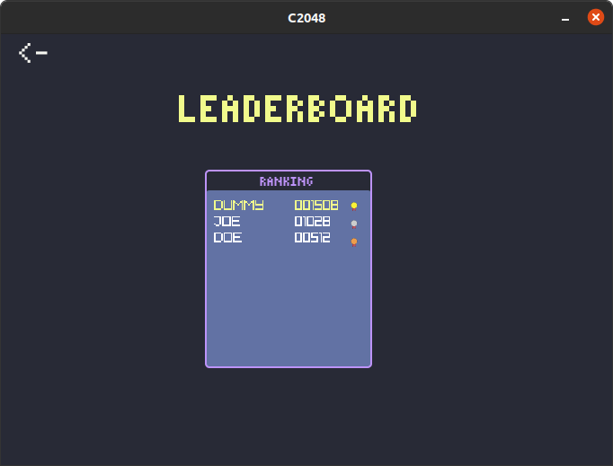
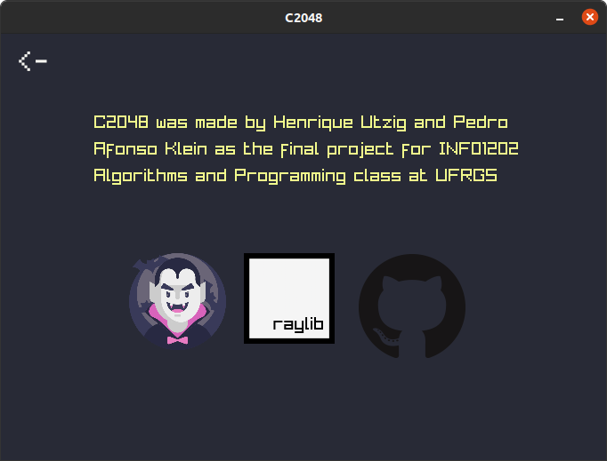

<p align="center">
  
</p>

<div align="center">
    <h4>
        C2048 is a clone of 2048 made by <a href="https://github.com/henriqueutzig">Henrique Utzig</a> and <a href="https://github.com/PedroKlein">Pedro Klein</a> written in C using <a href="https://raylib.com/">raylib</a> with <a href="https://draculatheme.com/">dracula</a> theme.
    </h4>
</div>

## Installation
```bash
    $ git clone https://github.com/henriqueutzig/C2048.git
    $ cd /C2048
    $ make
```
Linux
```bash
    $ ./C2048
```
Windows
```bash
    $ C2048.exe
```

## Screenshots
### Menu
<p align="center">
  
</p>

### Game
<p align="center">
  
</p>

### Leaderboard
<p align="center">
  
</p>

### Credits
<p align="center">
  
</p>